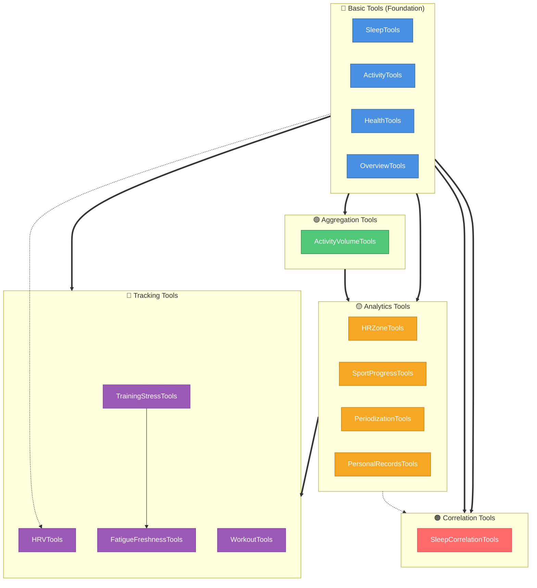
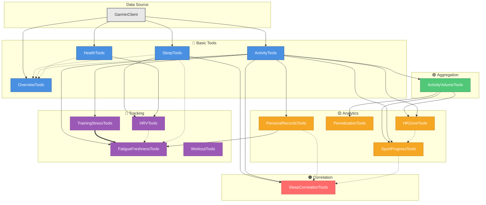

# Garmin Connect MCP Server - API Reference

**Version:** v0.1.0
**Last Updated:** 2025-10-19

## Table of Contents

- [Introduction](#introduction)
  - [Direct vs Advanced API](#direct-vs-advanced-api)
  - [Tool Categories](#tool-categories)
- [Direct API Tools](#direct-api-tools)
  - [Sleep Tools](#sleep-tools)
  - [Activity Tools](#activity-tools)
  - [Health Tools](#health-tools)
  - [Overview Tools](#overview-tools)
  - [Workout Tools](#workout-tools)
- [Advanced API Tools](#advanced-api-tools)
  - [Activity Volume Tools](#activity-volume-tools)
  - [HR Zone Tools](#hr-zone-tools)
  - [Sport Progress Tools](#sport-progress-tools)
  - [Periodization Tools](#periodization-tools)
  - [Personal Records Tools](#personal-records-tools)
  - [Sleep Correlation Tools](#sleep-correlation-tools)
  - [HRV Tools](#hrv-tools)
  - [Training Stress Tools](#training-stress-tools)
  - [Fatigue & Freshness Tools](#fatigue--freshness-tools)
- [Tool Dependencies](#tool-dependencies)
  - [High-Level Architecture](#high-level-architecture)
  - [Complete System Dependencies](#complete-system-dependencies)
- [Common Use Cases](#common-use-cases)
  - [Daily Training Check-in](#daily-training-check-in)
  - [Weekly Training Review](#weekly-training-review)
  - [Race Preparation](#race-preparation)
  - [Recovery Monitoring](#recovery-monitoring)
  - [Performance Analysis](#performance-analysis)
- [Error Handling](#error-handling)
  - [MCP-Level Errors](#mcp-level-errors)
  - [Garmin API Errors](#garmin-api-errors)
  - [Best Practices](#best-practices)

---

## Introduction

The Garmin Connect MCP Server provides two distinct API layers for accessing health, fitness, and training data from Garmin Connect. This document serves as the comprehensive reference for all available tools, their parameters, return values, and usage patterns.

### Direct vs Advanced API

#### Direct API (11 tools)

**Purpose:** Fast, straightforward access to raw Garmin Connect data with minimal processing.

**Characteristics:**
- **Direct mapping** to Garmin Connect API endpoints
- **Minimal processing** - returns data close to original API format
- **Fast response times** - simple data retrieval without complex calculations
- **Foundation layer** - provides raw data for advanced tools
- **Use when:** You need quick access to specific data points (today's sleep, recent activities, current weight)

**Tools:** SleepTools, ActivityTools, HealthTools, OverviewTools, WorkoutTools (creation only)

#### Advanced API (~34 tools)

**Purpose:** Sophisticated analysis, aggregation, and insights derived from raw data.

**Characteristics:**
- **Complex processing** - aggregates, analyzes, and correlates data
- **Multi-data source** - combines data from multiple Direct API calls
- **Statistical analysis** - calculates trends, patterns, and predictions
- **Higher latency** - processes larger datasets for deeper insights
- **Use when:** You need training insights, performance trends, recovery analysis, or planning recommendations

**Tools:** ActivityVolumeTools, HRZoneTools, SportProgressTools, PeriodizationTools, PersonalRecordsTools, SleepCorrelationTools, HRVTools, TrainingStressTools, FatigueFreshnessTools

### Tool Categories

| Category | Layer | Purpose | Example Tools |
|----------|-------|---------|---------------|
| **Basic** | Direct | Raw data access | SleepTools, ActivityTools, HealthTools |
| **Aggregation** | Advanced | Time-based summarization | ActivityVolumeTools |
| **Analytics** | Advanced | Performance analysis | HRZoneTools, SportProgressTools |
| **Correlation** | Advanced | Multi-metric relationships | SleepCorrelationTools |
| **Tracking** | Advanced | Trends and predictions | HRVTools, FatigueFreshnessTools |

---

## Direct API Tools

### Sleep Tools

Retrieve sleep data including sleep stages, quality scores, and physiological measurements.

#### `get_sleep_data`

Retrieve comprehensive sleep metrics with optional summary or field filtering.

**Parameters:**

| Parameter | Type | Required | Default | Description |
|-----------|------|----------|---------|-------------|
| `date` | string | No | today | Target date in YYYY-MM-DD format |
| `includeSummaryOnly` | boolean | No | false | Return only key metrics for faster analysis |
| `fields` | string[] | No | all | Specific fields to include (e.g., ['dailySleepDTO', 'avgOvernightHrv']) |
| `summary` | boolean | No | false | **DEPRECATED:** Use `includeSummaryOnly` instead |

**Returns:**

```typescript
{
  date: string;
  dailySleepDTO?: {
    sleepTimeSeconds: number;
    deepSleepSeconds: number;
    lightSleepSeconds: number;
    remSleepSeconds: number;
    awakeSleepSeconds: number;
    sleepStartTimestampGMT: number;
    sleepEndTimestampGMT: number;
    sleepQualityTypePK: number;
  };
  restingHeartRate?: number;
  avgOvernightHrv?: number;
  // ... additional fields when not using summary mode
}
```

**Example:**

```typescript
// Get summary sleep data for today
const result = await sleepTools.getSleepData({ includeSummaryOnly: true });

// Get specific fields for analysis
const result = await sleepTools.getSleepData({
  date: '2025-10-15',
  fields: ['dailySleepDTO', 'avgOvernightHrv']
});
```

**Throws:**
- Error if date format is invalid
- Error if Garmin API is unavailable

---

#### `get_sleep_duration`

Retrieve total sleep duration for quick sleep tracking.

**Parameters:**

| Parameter | Type | Required | Default | Description |
|-----------|------|----------|---------|-------------|
| `date` | string | No | today | Target date in YYYY-MM-DD format |

**Returns:**

```typescript
{
  date: string;
  durationMinutes: number;
  durationHours: number;
}
```

**Example:**

```typescript
// Get today's sleep duration
const result = await sleepTools.getSleepDuration({});
```

**Throws:**
- Error if date format is invalid
- Error if Garmin API is unavailable

---

### Activity Tools

Retrieve activity data including workouts, training sessions, and performance metrics.

#### `get_activities`

Retrieve recent activities with pagination and optional summary format.

**Parameters:**

| Parameter | Type | Required | Default | Description |
|-----------|------|----------|---------|-------------|
| `start` | number | No | 0 | Starting index for pagination |
| `limit` | number | No | 20 | Maximum activities to return (capped at 50) |
| `includeSummaryOnly` | boolean | No | false | Return only key metrics for faster processing |
| `summary` | boolean | No | false | **DEPRECATED:** Use `includeSummaryOnly` instead |

**Returns:**

```typescript
{
  count: number;
  pagination?: {
    start: number;
    limit: number;
    hasMore: boolean;
  };
  activities: Array<{
    activityId: number;
    name: string;
    type: string;
    date: string;
    duration: number; // minutes
    distance?: number; // km
    calories?: number;
    averageHR?: number;
    maxHR?: number;
    // ... additional fields when not using summary mode
  }>;
}
```

**Example:**

```typescript
// Get last 10 activities in summary format
const result = await activityTools.getActivities({
  limit: 10,
  includeSummaryOnly: true
});

// Paginate through activities
const result = await activityTools.getActivities({
  start: 20,
  limit: 20
});
```

**Throws:**
- Error if Garmin API is unavailable
- Error if response exceeds size limits

---

#### `get_activity_details`

Retrieve comprehensive details for a specific activity including splits and advanced metrics.

**Parameters:**

| Parameter | Type | Required | Default | Description |
|-----------|------|----------|---------|-------------|
| `activityId` | number | Yes | - | Unique identifier of the activity (from `get_activities`) |

**Returns:**

```typescript
{
  activityId: number;
  basic: {
    name: string;
    description?: string;
    type: { key: string; id: number; parentId?: number };
    locationName?: string;
  };
  timing: {
    startTimeLocal: string;
    duration: number; // minutes
    elapsedDuration: number;
    movingDuration: number;
  };
  performance: {
    distance?: number; // km
    calories: number;
    averageSpeed?: number;
    maxSpeed?: number;
    elevationGain?: number;
    elevationLoss?: number;
  };
  heartRate: {
    average?: number;
    max?: number;
  };
  training: {
    aerobicEffect?: number;
    anaerobicEffect?: number;
    trainingEffectLabel?: string;
    vO2MaxValue?: number;
  };
  splitSummaries?: Array<{
    distance: number;
    duration: number;
    averageSpeed: number;
    averageHR: number;
  }>;
}
```

**Example:**

```typescript
// Get full details for an activity
const result = await activityTools.getActivityDetails({
  activityId: 12345678901
});
```

**Throws:**
- Error if activity ID is invalid or not found
- Error if Garmin API is unavailable

---

### Health Tools

Retrieve health and wellness metrics for daily health tracking.

#### `get_health_metrics`

Retrieve aggregated health metrics with flexible metric selection.

**Parameters:**

| Parameter | Type | Required | Default | Description |
|-----------|------|----------|---------|-------------|
| `date` | string | No | today | Target date in YYYY-MM-DD format |
| `metrics` | string[] | No | all | Specific metrics: ['steps', 'weight', 'heart_rate', 'stress', 'body_battery'] |

**Returns:**

```typescript
{
  date: string;
  metrics: {
    steps?: {
      steps: number;
      goal: number;
      goalProgress: string; // percentage
      distanceKm: number;
    };
    heart_rate?: {
      restingHR: number;
      maxHR: number;
      minHR: number;
      lastSevenDaysAvg: number;
    };
    weight?: {
      weightKg: number;
      bmi: number;
      bodyFat?: number;
      muscleMass?: number;
    };
  };
  hints?: string[];
}
```

**Example:**

```typescript
// Get all available health metrics
const result = await healthTools.getHealthMetrics({});

// Get specific metrics only
const result = await healthTools.getHealthMetrics({
  date: '2025-10-15',
  metrics: ['steps', 'heart_rate']
});
```

**Throws:**
- Error if all requested metrics fail to retrieve

---

#### `get_steps_data`

Get detailed step count and distance data.

**Parameters:**

| Parameter | Type | Required | Default | Description |
|-----------|------|----------|---------|-------------|
| `date` | string | No | today | Target date in YYYY-MM-DD format |
| `includeSummaryOnly` | boolean | No | false | Return only key metrics |

**Returns:**

```typescript
{
  date: string;
  steps: {
    total: number;
    goal: number;
    goalProgress: number;
    goalProgressPercent: string;
  };
  distance: {
    meters: number;
    kilometers: number;
  };
}
```

**Example:**

```typescript
// Get today's steps in summary format
const result = await healthTools.getStepsData({
  includeSummaryOnly: true
});
```

---

#### `get_heart_rate_data`

Retrieve comprehensive heart rate statistics and time-series data.

**Parameters:**

| Parameter | Type | Required | Default | Description |
|-----------|------|----------|---------|-------------|
| `date` | string | No | today | Target date in YYYY-MM-DD format |
| `includeSummaryOnly` | boolean | No | false | Return only summary statistics |

**Returns:**

```typescript
{
  date: string;
  summary: {
    restingHR: number;
    maxHR: number;
    minHR: number;
    lastSevenDaysAvgRestingHR: number;
  };
  timeSeries?: {
    values: number[];
    descriptors: string[];
    sampleCount: number;
  };
}
```

**Example:**

```typescript
// Get summary heart rate stats
const result = await healthTools.getHeartRateData({
  includeSummaryOnly: true
});

// Get detailed time-series data
const result = await healthTools.getHeartRateData({
  date: '2025-10-15'
});
```

---

#### `get_weight_data`

Access body composition including weight, BMI, body fat, and muscle mass.

**Parameters:**

| Parameter | Type | Required | Default | Description |
|-----------|------|----------|---------|-------------|
| `date` | string | No | today | Target date in YYYY-MM-DD format |

**Returns:**

```typescript
{
  date: string;
  weight: {
    weightKg: number;
    bmi: number;
    bodyFat?: number;
    bodyWater?: number;
    boneMass?: number;
    muscleMass?: number;
    physiqueRating?: number;
    visceralFat?: number;
    metabolicAge?: number;
  };
}
```

**Example:**

```typescript
// Get today's weight and body composition
const result = await healthTools.getWeightData({});
```

**Throws:**
- Error if Garmin API is unavailable
- Error if no weight data exists

---

### Overview Tools

Unified daily summaries combining sleep, activities, and health metrics.

#### `get_daily_overview`

Retrieve comprehensive daily summary in a single request.

**Parameters:**

| Parameter | Type | Required | Default | Description |
|-----------|------|----------|---------|-------------|
| `date` | string | No | today | Target date in YYYY-MM-DD format |

**Returns:**

```typescript
{
  date: string;
  sleep?: {
    totalSleep: number; // minutes
    sleepScore?: number;
    quality?: string;
  };
  activities?: Array<{
    id: string;
    type: string;
    name: string;
    duration: number;
    distance?: number;
    calories?: number;
  }>;
  health?: {
    steps?: number;
    restingHR?: number;
    weight?: number;
  };
  hints?: string[];
}
```

**Example:**

```typescript
// Get today's overview
const result = await overviewTools.getDailyOverview({});

// Get overview for specific date
const result = await overviewTools.getDailyOverview({
  date: '2025-10-15'
});
```

**Throws:**
- Error if all data sources fail (individual failures handled gracefully)

---

### Workout Tools

Create and schedule structured workouts to Garmin Connect calendar.

#### `create_running_workout`

Create a structured running workout with steps (warmup, interval, recovery, cooldown, repeat).

**Parameters:**

| Parameter | Type | Required | Default | Description |
|-----------|------|----------|---------|-------------|
| `name` | string | Yes | - | Workout name (non-empty) |
| `description` | string | No | - | Optional workout description |
| `steps` | WorkoutStep[] | Yes | - | Array of workout steps (at least one) |

**WorkoutStep Structure:**

```typescript
{
  type: 'warmup' | 'interval' | 'recovery' | 'cooldown' | 'rest' | 'repeat';

  // Duration (not required for repeat blocks)
  duration?: {
    type: 'time' | 'distance' | 'lap_button';
    value?: number; // seconds for time, meters for distance
    unit?: 'm' | 'km' | 'mile'; // required for distance
  };

  // Intensity target (optional)
  target?: {
    type: 'pace' | 'hr_zone' | 'no_target';
    minValue?: number; // min/km for pace
    maxValue?: number; // min/km for pace
    zone?: number; // 1-5 for hr_zone
  };

  // For repeat blocks only
  numberOfRepetitions?: number; // positive integer
  childSteps?: WorkoutStep[]; // steps to repeat
}
```

**Returns:**

```typescript
{
  success: boolean;
  workoutId: number;
  workoutName: string;
  message: string;
  createdDate: string;
}
```

**Example:**

```typescript
// Create interval workout
const result = await workoutTools.createRunningWorkout({
  name: "5x1000m Intervals",
  description: "Threshold pace intervals with recovery",
  steps: [
    {
      type: 'warmup',
      duration: { type: 'time', value: 600 }, // 10 min
      target: { type: 'no_target' }
    },
    {
      type: 'repeat',
      numberOfRepetitions: 5,
      childSteps: [
        {
          type: 'interval',
          duration: { type: 'distance', value: 1000, unit: 'm' },
          target: { type: 'pace', minValue: 4.0, maxValue: 4.3 } // 4:00-4:18/km
        },
        {
          type: 'recovery',
          duration: { type: 'time', value: 120 }, // 2 min
          target: { type: 'no_target' }
        }
      ]
    },
    {
      type: 'cooldown',
      duration: { type: 'time', value: 600 },
      target: { type: 'no_target' }
    }
  ]
});
```

**Throws:**
- Validation errors for invalid step structure
- Authentication errors if credentials invalid
- Garmin API errors for service unavailability

---

#### `schedule_workout`

Schedule a workout to a specific date in Garmin Connect calendar.

**Parameters:**

| Parameter | Type | Required | Default | Description |
|-----------|------|----------|---------|-------------|
| `workoutId` | number | Yes | - | ID from `create_running_workout` response |
| `date` | string | Yes | - | Date in YYYY-MM-DD format (e.g., '2025-10-13') |

**Returns:**

```typescript
{
  success: boolean;
  workoutScheduleId: number;
  workoutId: number;
  calendarDate: string;
  message: string;
}
```

**Example:**

```typescript
// Schedule workout to specific date
const result = await workoutTools.scheduleWorkout({
  workoutId: 987654321,
  date: '2025-10-25'
});
```

**Throws:**
- Validation error if workoutId or date format invalid
- Error if workout not found
- Authentication errors if credentials invalid

---

## Advanced API Tools

### Activity Volume Tools

Training volume aggregation across flexible time periods for workload monitoring.

#### `get_weekly_volume`

Aggregate training volume for a specific ISO week with optional trends.

**Parameters:**

| Parameter | Type | Required | Default | Description |
|-----------|------|----------|---------|-------------|
| `year` | number | No | current year | Target year |
| `week` | number | No | current week | ISO week number (1-53) |
| `includeActivityBreakdown` | boolean | No | true | Include per-activity-type breakdown |
| `includeTrends` | boolean | No | false | Compare with previous week |
| `maxActivities` | number | No | 1000 | Maximum activities to process |
| `activityTypes` | string[] | No | all | Filter by types (e.g., ['running', 'cycling']) |

**Returns:**

```typescript
{
  year: number;
  week: number;
  startDate: string;
  endDate: string;
  metrics: {
    duration: number; // minutes
    distance: number; // km
    elevationGain: number; // meters
    calories: number;
    activities: number; // count
  };
  byActivityType?: {
    [activityType: string]: VolumeMetrics;
  };
  trends?: {
    durationChange: number; // percentage
    distanceChange: number;
    volumeDirection: 'increasing' | 'decreasing' | 'stable';
  };
}
```

**Example:**

```typescript
// Get current week's volume with trends
const result = await volumeTools.getWeeklyVolume({
  includeTrends: true
});

// Get specific week for single sport
const result = await volumeTools.getWeeklyVolume({
  year: 2025,
  week: 42,
  activityTypes: ['running']
});
```

---

#### `get_monthly_volume`

Aggregate training volume for a calendar month with optional trends.

**Parameters:**

| Parameter | Type | Required | Default | Description |
|-----------|------|----------|---------|-------------|
| `year` | number | No | current year | Target year |
| `month` | number | No | current month | Month number (1-12) |
| `includeActivityBreakdown` | boolean | No | true | Include per-activity-type breakdown |
| `includeTrends` | boolean | No | false | Compare with previous month |
| `maxActivities` | number | No | 1000 | Maximum activities to process |
| `activityTypes` | string[] | No | all | Filter by specific types |

**Returns:** Similar to `get_weekly_volume` with month-specific fields.

**Example:**

```typescript
// Get current month's volume
const result = await volumeTools.getMonthlyVolume({
  includeActivityBreakdown: true
});
```

---

#### `get_custom_range_volume`

Aggregate training volume over any date range with optional daily breakdown.

**Parameters:**

| Parameter | Type | Required | Default | Description |
|-----------|------|----------|---------|-------------|
| `dateRange` | string | Yes | - | Format: YYYY-MM-DD/YYYY-MM-DD (max 365 days) |
| `includeActivityBreakdown` | boolean | No | true | Include per-activity-type breakdown |
| `includeDailyBreakdown` | boolean | No | false | Include daily breakdown for the range |
| `maxActivities` | number | No | 1000 | Maximum activities to process |
| `activityTypes` | string[] | No | all | Filter by specific types |

**Returns:**

```typescript
{
  dateRange: string;
  startDate: string;
  endDate: string;
  metrics: VolumeMetrics;
  byActivityType?: { [type: string]: VolumeMetrics };
  dailyBreakdown?: Array<{
    date: string;
    metrics: VolumeMetrics;
  }>;
}
```

**Example:**

```typescript
// Analyze training block
const result = await volumeTools.getCustomRangeVolume({
  dateRange: '2025-09-01/2025-10-15',
  includeDailyBreakdown: true
});
```

---

### HR Zone Tools

Heart rate zone distribution analysis for training intensity monitoring.

#### `get_activity_hr_zones`

Analyze HR zone distribution for a single activity.

**Parameters:**

| Parameter | Type | Required | Default | Description |
|-----------|------|----------|---------|-------------|
| `activityId` | number | Yes | - | Unique identifier of the activity |
| `maxHR` | number | No | activity max or 185 | Custom maximum heart rate for zone calculation |
| `customZones` | object | No | standard zones | Custom zone ranges as % of max HR |

**Custom Zones Structure:**

```typescript
{
  zone1: { min: 0, max: 60 },    // % of max HR
  zone2: { min: 60, max: 70 },
  zone3: { min: 70, max: 80 },
  zone4: { min: 80, max: 90 },
  zone5: { min: 90, max: 100 }
}
```

**Returns:**

```typescript
{
  activityId: number;
  activityName: string;
  activityType: string;
  duration: number; // seconds
  zoneDistribution: Array<{
    zone: number; // 1-5
    timeSeconds: number;
    percentage: number;
    hrRange: { min: number; max: number };
  }>;
  summary: {
    totalTimeInZones: number;
    averageHR: number;
    maxHR: number;
    dominantZone: number;
  };
  visualization?: {
    labels: string[];
    values: number[];
    colors: string[];
  };
}
```

**Example:**

```typescript
// Analyze zones for an activity
const result = await hrZoneTools.getActivityHRZones({
  activityId: 12345678901
});

// Use custom max HR and zones
const result = await hrZoneTools.getActivityHRZones({
  activityId: 12345678901,
  maxHR: 190,
  customZones: {
    zone1: { min: 0, max: 60 },
    zone2: { min: 60, max: 70 },
    zone3: { min: 70, max: 80 },
    zone4: { min: 80, max: 90 },
    zone5: { min: 90, max: 100 }
  }
});
```

---

#### `get_aggregated_hr_zones`

Aggregate HR zone distribution across multiple activities in a period.

**Parameters:**

| Parameter | Type | Required | Default | Description |
|-----------|------|----------|---------|-------------|
| `periodType` | string | No | - | 'weekly', 'monthly', or 'custom' |
| `year` | number | No (required for weekly/monthly) | - | Target year |
| `week` | number | No (required for weekly) | - | ISO week number |
| `month` | number | No (required for monthly) | - | Month number (1-12) |
| `dateRange` | string | No (required for custom) | - | Format: YYYY-MM-DD/YYYY-MM-DD |
| `maxHR` | number | No | 185 | Custom maximum heart rate |
| `customZones` | object | No | standard zones | Custom zone configuration |
| `activityTypes` | string[] | No | all | Filter by specific types |
| `includeActivityBreakdown` | boolean | No | true | Breakdown by activity type |
| `includeVisualization` | boolean | No | true | Include visualization data |
| `maxActivities` | number | No | 1000 | Maximum activities to process |

**Returns:**

```typescript
{
  period: {
    type: string;
    startDate: string;
    endDate: string;
  };
  zoneDistribution: Array<{
    zone: number;
    totalTimeSeconds: number;
    percentage: number;
  }>;
  byActivityType?: {
    [type: string]: ZoneDistribution;
  };
  summary: {
    totalActivities: number;
    totalTimeInZones: number;
    averageHR: number;
    dominantZone: number;
    polarizationIndex?: number; // Zone 1 + Zone 5 percentage (80/20 rule)
  };
  visualization?: {
    labels: string[];
    values: number[];
    colors: string[];
  };
}
```

**Example:**

```typescript
// Weekly zone analysis
const result = await hrZoneTools.getAggregatedHRZones({
  periodType: 'weekly',
  year: 2025,
  week: 42
});

// Custom date range for running only
const result = await hrZoneTools.getAggregatedHRZones({
  periodType: 'custom',
  dateRange: '2025-09-01/2025-10-15',
  activityTypes: ['running']
});
```

---

### Sport Progress Tools

Comprehensive sport-specific progress analysis including pace/power trends.

#### `get_sport_progress`

Analyze pace/power trends and efficiency metrics over a date range.

**Parameters:**

| Parameter | Type | Required | Default | Description |
|-----------|------|----------|---------|-------------|
| `dateRange` | string | Yes | - | Format: YYYY-MM-DD/YYYY-MM-DD |
| `sport` | string | No | auto-detect | Filter by sport ('running', 'cycling', 'swimming') |
| `includeEfficiency` | boolean | No | true | Include HR zone efficiency analysis |
| `minDuration` | number | No | - | Minimum activity duration in seconds |
| `maxActivities` | number | No | 1000 | Maximum activities to analyze |

**Returns:**

```typescript
{
  sport: string;
  dateRange: string;
  analysis: {
    pace?: {
      trend: 'improving' | 'declining' | 'stable';
      averagePace: number; // min/km
      bestPace: number;
      improvement: number; // percentage
    };
    power?: {
      trend: 'improving' | 'declining' | 'stable';
      averagePower: number; // watts
      normalizedPower: number;
      powerToWeight?: number;
    };
    efficiency?: {
      byZone: Array<{
        zone: number;
        avgPace?: number;
        avgPower?: number;
        efficiency: number;
      }>;
      recommendations: string[];
    };
  };
  activities: number; // count analyzed
}
```

**Example:**

```typescript
// Analyze running progress
const result = await sportProgressTools.getSportProgress({
  dateRange: '2025-08-01/2025-10-15',
  sport: 'running',
  minDuration: 1200 // 20+ minutes
});
```

---

#### `get_pace_trends`

Analyze pace trends for running/swimming with regression analysis.

**Parameters:**

| Parameter | Type | Required | Default | Description |
|-----------|------|----------|---------|-------------|
| `dateRange` | string | Yes | - | Format: YYYY-MM-DD/YYYY-MM-DD |
| `sport` | string | No | 'running' | 'running' or 'swimming' |
| `minDuration` | number | No | - | Minimum activity duration in seconds |
| `maxActivities` | number | No | 1000 | Maximum activities to analyze |

**Returns:** Detailed pace trend analysis with moving averages and regression.

---

#### `get_power_trends`

Analyze power trends for cycling including normalized power and power-to-weight.

**Parameters:**

| Parameter | Type | Required | Default | Description |
|-----------|------|----------|---------|-------------|
| `dateRange` | string | Yes | - | Format: YYYY-MM-DD/YYYY-MM-DD |
| `sport` | string | No | 'cycling' | Sport type |
| `weight` | number | No | - | Athlete weight in kg for power-to-weight |
| `minDuration` | number | No | - | Minimum activity duration in seconds |
| `maxActivities` | number | No | 1000 | Maximum activities to analyze |

**Returns:** Power trend analysis with normalized power metrics.

---

#### `get_efficiency_metrics`

Analyze training efficiency by HR zone (pace or power relative to heart rate).

**Parameters:**

| Parameter | Type | Required | Default | Description |
|-----------|------|----------|---------|-------------|
| `dateRange` | string | Yes | - | Format: YYYY-MM-DD/YYYY-MM-DD |
| `sport` | string | No | all | Filter by sport type |
| `maxHR` | number | No | - | Custom maximum heart rate |
| `minDuration` | number | No | - | Minimum activity duration in seconds |
| `maxActivities` | number | No | 1000 | Maximum activities to analyze |

**Returns:** Efficiency analysis showing optimal training intensities.

---

### Periodization Tools

Training periodization analysis for identifying training phases and effectiveness.

#### `get_periodization_analysis`

Analyze training periodization effectiveness across a date range.

**Parameters:**

| Parameter | Type | Required | Default | Description |
|-----------|------|----------|---------|-------------|
| `dateRange` | string | Yes | - | Format: YYYY-MM-DD/YYYY-MM-DD (min 8 weeks, max 52 weeks) |
| `targetModel` | string | No | auto-detect | Expected model: 'linear', 'undulating', 'block', 'polarized' |
| `minPhaseWeeks` | number | No | 2 | Minimum phase length in weeks (1-8) |
| `includeRecommendations` | boolean | No | true | Include phase transition recommendations |
| `includeWarnings` | boolean | No | true | Include training warnings |
| `maxActivities` | number | No | 2000 | Maximum activities to analyze |

**Returns:**

```typescript
{
  dateRange: string;
  detectedModel: 'linear' | 'undulating' | 'block' | 'polarized';
  phases: Array<{
    type: 'base' | 'build' | 'peak' | 'recovery' | 'transition';
    startDate: string;
    endDate: string;
    weeks: number;
    volumeChange: number; // percentage
    intensityChange: number;
    effectiveness: number; // 0-100 score
  }>;
  analysis: {
    overallEffectiveness: number;
    phaseBalance: string; // 'good', 'needs-adjustment'
    recommendations: string[];
    warnings?: string[];
  };
}
```

**Example:**

```typescript
// Analyze 12-week training block
const result = await periodizationTools.getPeriodizationAnalysis({
  dateRange: '2025-07-01/2025-09-30',
  targetModel: 'linear',
  includeRecommendations: true
});
```

**Throws:**
- Error if date range is less than 8 weeks

---

### Personal Records Tools

Personal record tracking with progression history and automated detection.

#### `get_personal_records`

Get current personal records with optional filters.

**Parameters:**

| Parameter | Type | Required | Default | Description |
|-----------|------|----------|---------|-------------|
| `sport` | string | No | all | Filter by sport |
| `categoryType` | string | No | all | 'distance', 'duration', or 'custom' |
| `categoryId` | string | No | all | Specific category (e.g., '5K', 'marathon') |
| `minQuality` | number | No | - | Minimum quality score (0-100) |
| `includeSummary` | boolean | No | true | Include summary statistics |

**Returns:**

```typescript
{
  personalRecords: Array<{
    categoryId: string;
    categoryName: string;
    categoryType: 'distance' | 'duration' | 'custom';
    sport: string;
    value: number; // seconds or meters
    formattedValue: string; // "21:30" or "5.2 km"
    activityId: number;
    activityDate: string;
    quality: number; // 0-100 score
    achievements?: string[];
  }>;
  summary?: {
    totalPRs: number;
    bySport: { [sport: string]: number };
    byCategory: { [category: string]: number };
    recentPRs: number; // last 30 days
  };
}
```

**Example:**

```typescript
// Get all running PRs
const result = await prTools.getPersonalRecords({
  sport: 'running',
  includeSummary: true
});

// Get high-quality 5K records
const result = await prTools.getPersonalRecords({
  categoryId: '5K',
  minQuality: 80
});
```

---

#### `get_pr_history`

Get PR progression history for a specific category.

**Parameters:**

| Parameter | Type | Required | Default | Description |
|-----------|------|----------|---------|-------------|
| `categoryId` | string | Yes | - | Category ID (e.g., '5K', 'marathon') |
| `sport` | string | No (required for progression) | - | Sport type for progression analysis |
| `dateRange` | string | No | all time | Optional filter: YYYY-MM-DD/YYYY-MM-DD |
| `includeProgression` | boolean | No | true | Include progression analysis with trends |
| `limit` | number | No | all | Maximum history entries to return |

**Returns:**

```typescript
{
  category: {
    id: string;
    name: string;
    type: string;
  };
  history: Array<{
    value: number;
    formattedValue: string;
    activityId: number;
    date: string;
    improvement?: number; // vs previous PR
  }>;
  progression?: {
    totalImprovement: number; // percentage
    trend: 'improving' | 'plateauing';
    averageImprovement: number;
    milestones: Array<{
      date: string;
      achievement: string;
    }>;
  };
}
```

**Example:**

```typescript
// Get 5K progression
const result = await prTools.getPRHistory({
  categoryId: '5K',
  sport: 'running',
  includeProgression: true
});
```

---

#### `detect_new_prs`

Scan recent activities to detect new personal records.

**Parameters:**

| Parameter | Type | Required | Default | Description |
|-----------|------|----------|---------|-------------|
| `dateRange` | string | No | - | Optional: YYYY-MM-DD/YYYY-MM-DD |
| `sports` | string[] | No | all | Filter by specific sports |
| `categories` | string[] | No | all | Filter by specific categories |
| `minQuality` | number | No | 70 | Minimum quality score threshold |
| `enableSegments` | boolean | No | true | Extract segments from splits |
| `maxActivities` | number | No | 1000 | Maximum activities to scan |

**Returns:**

```typescript
{
  detectedPRs: Array<{
    categoryId: string;
    categoryName: string;
    sport: string;
    value: number;
    formattedValue: string;
    activityId: number;
    activityDate: string;
    quality: number;
    isNew: boolean; // new PR vs improved existing
    previousValue?: number;
    improvement?: number;
  }>;
  summary: {
    totalDetected: number;
    newPRs: number;
    improvedPRs: number;
    bySport: { [sport: string]: number };
  };
}
```

**Example:**

```typescript
// Scan last 30 days for new PRs
const result = await prTools.detectNewPRs({
  dateRange: '2025-09-15/2025-10-15',
  minQuality: 75
});
```

---

#### `manage_custom_pr_category`

Create, update, delete, or list custom PR categories.

**Parameters:**

| Parameter | Type | Required | Default | Description |
|-----------|------|----------|---------|-------------|
| `action` | string | Yes | - | 'create', 'update', 'delete', or 'list' |
| `id` | string | No (required for create/update/delete) | - | Category ID |
| `name` | string | No (required for create) | - | Display name |
| `type` | string | No (required for create) | - | 'distance' or 'duration' |
| `value` | number | No | - | Value in meters (distance) or seconds (duration) |
| `sport` | string | No | - | Optional sport restriction |
| `tolerance` | number | No | auto-calculated | Optional matching tolerance |

**Returns:**

```typescript
// For 'list' action
{
  categories: Array<{
    id: string;
    name: string;
    type: 'distance' | 'duration';
    value: number;
    sport?: string;
    tolerance: number;
  }>;
}

// For 'create', 'update', 'delete' actions
{
  success: boolean;
  category?: {
    id: string;
    name: string;
    // ...
  };
  message: string;
}
```

**Example:**

```typescript
// Create custom 3K category
const result = await prTools.manageCustomPRCategory({
  action: 'create',
  id: '3K',
  name: '3 Kilometers',
  type: 'distance',
  value: 3000,
  sport: 'running'
});

// List all custom categories
const result = await prTools.manageCustomPRCategory({
  action: 'list'
});
```

---

### Sleep Correlation Tools

Sleep-performance correlation analysis for understanding recovery impact.

#### `get_sleep_performance_correlation`

Comprehensive analysis of sleep-performance relationships.

**Parameters:**

| Parameter | Type | Required | Default | Description |
|-----------|------|----------|---------|-------------|
| `dateRange` | string | No | last 30 days | Format: YYYY-MM-DD/YYYY-MM-DD |
| `includeRecovery` | boolean | No | true | Include daily recovery quality assessments |
| `maxPoorSleepImpacts` | number | No | 10 | Maximum poor sleep impacts to return (1-50) |

**Returns:**

```typescript
{
  dateRange: string;
  correlations: {
    sleepDuration: {
      coefficient: number; // -1 to 1
      strength: 'strong' | 'moderate' | 'weak';
      description: string;
    };
    deepSleep: { /* same structure */ };
    remSleep: { /* same structure */ };
    sleepQuality: { /* same structure */ };
  };
  optimalPatterns: {
    duration: { min: number; max: number; unit: 'hours' };
    deepSleep: number; // minutes
    remSleep: number;
    qualityScore: number;
  };
  sleepDebt: {
    currentDebt: number; // minutes
    averageDebt: number;
    maxDebt: number;
    recoveryTimeNeeded: number; // days
  };
  poorSleepImpacts: Array<{
    date: string;
    sleepQuality: string;
    performanceImpact: string;
    affectedMetrics: string[];
    severity: 'low' | 'moderate' | 'high';
  }>;
  trends: {
    sleepQuality: 'improving' | 'declining' | 'stable';
    performanceCorrelation: 'strengthening' | 'weakening';
  };
  insights: string[];
  recommendations: string[];
}
```

**Example:**

```typescript
// Analyze last 30 days
const result = await sleepCorrelationTools.getSleepPerformanceCorrelation({});

// Custom date range
const result = await sleepCorrelationTools.getSleepPerformanceCorrelation({
  dateRange: '2025-09-01/2025-10-15',
  includeRecovery: true
});
```

---

#### `get_optimal_sleep_pattern`

Identify optimal sleep pattern for best performance.

**Parameters:**

| Parameter | Type | Required | Default | Description |
|-----------|------|----------|---------|-------------|
| `dateRange` | string | No | last 60 days | Format: YYYY-MM-DD/YYYY-MM-DD |

**Returns:**

```typescript
{
  optimal: {
    duration: { min: number; max: number; unit: 'hours' };
    deepSleepMinutes: number;
    remSleepMinutes: number;
    qualityScore: number;
  };
  analysis: {
    sampleSize: number;
    confidenceLevel: number;
    recommendations: string[];
  };
}
```

**Example:**

```typescript
// Find optimal sleep pattern
const result = await sleepCorrelationTools.getOptimalSleepPattern({
  dateRange: '2025-08-01/2025-10-15'
});
```

---

#### `get_sleep_debt_analysis`

Track accumulated sleep debt and performance impact.

**Parameters:**

| Parameter | Type | Required | Default | Description |
|-----------|------|----------|---------|-------------|
| `dateRange` | string | No | last 30 days | Format: YYYY-MM-DD/YYYY-MM-DD |
| `targetDuration` | number | No | 480 | Target sleep duration in minutes (360-600) |

**Returns:**

```typescript
{
  currentDebt: number; // minutes
  averageDebt: number;
  maxDebt: number;
  debtHistory: Array<{
    date: string;
    debtMinutes: number;
  }>;
  performanceImpact: {
    correlation: number;
    description: string;
  };
  recoveryEstimate: {
    daysNeeded: number;
    targetSleepPerNight: number;
  };
}
```

**Example:**

```typescript
// Analyze sleep debt
const result = await sleepCorrelationTools.getSleepDebtAnalysis({
  targetDuration: 480 // 8 hours
});
```

---

#### `get_recovery_quality`

Assess recovery quality and readiness to train based on sleep.

**Parameters:**

| Parameter | Type | Required | Default | Description |
|-----------|------|----------|---------|-------------|
| `date` | string | No | today | Date to assess (YYYY-MM-DD) |
| `days` | number | No | 7 | Number of recent days to assess (1-30) |

**Returns:**

```typescript
{
  date: string;
  recoveryScore: number; // 0-100
  readiness: 'high' | 'moderate' | 'low';
  recentDays: Array<{
    date: string;
    sleepQuality: number;
    recoveryScore: number;
  }>;
  trainingRecommendation: {
    intensity: 'high' | 'moderate' | 'low' | 'rest';
    rationale: string;
  };
  factors: {
    sleepDuration: number;
    sleepQuality: number;
    consistency: number;
    debt: number;
  };
}
```

**Example:**

```typescript
// Assess today's recovery
const result = await sleepCorrelationTools.getRecoveryQuality({
  days: 7
});
```

---

#### `detect_poor_sleep_impacts`

Identify instances where poor sleep negatively impacted performance.

**Parameters:**

| Parameter | Type | Required | Default | Description |
|-----------|------|----------|---------|-------------|
| `dateRange` | string | No | last 30 days | Format: YYYY-MM-DD/YYYY-MM-DD |
| `maxImpacts` | number | No | 10 | Maximum impacts to return (1-50) |
| `minSeverity` | string | No | 'low' | Minimum severity: 'low', 'moderate', 'high' |

**Returns:**

```typescript
{
  impacts: Array<{
    sleepDate: string;
    performanceDate: string;
    sleepMetrics: {
      duration: number;
      quality: number;
      deepSleep: number;
    };
    performanceMetrics: {
      affected: string[]; // ['pace', 'heart_rate', 'power']
      decline: number; // percentage
    };
    severity: 'low' | 'moderate' | 'high';
    description: string;
  }>;
  summary: {
    totalImpacts: number;
    bySeverity: {
      high: number;
      moderate: number;
      low: number;
    };
  };
}
```

**Example:**

```typescript
// Find moderate+ sleep impacts
const result = await sleepCorrelationTools.detectPoorSleepImpacts({
  minSeverity: 'moderate',
  maxImpacts: 20
});
```

---

### HRV Tools

Heart rate variability tracking and readiness assessment.

#### `get_hrv_trends`

Analyze HRV trends with rolling averages and baseline deviations.

**Parameters:**

| Parameter | Type | Required | Default | Description |
|-----------|------|----------|---------|-------------|
| `startDate` | string | No | 30 days ago | Start date (YYYY-MM-DD) |
| `endDate` | string | No | today | End date (YYYY-MM-DD) |
| `syncFromGarmin` | boolean | No | true | Sync HRV data from Garmin before analysis |

**Returns:**

```typescript
{
  dateRange: { start: string; end: string };
  current: {
    value: number; // ms
    date: string;
    deviationFromBaseline: number; // percentage
  };
  trends: {
    weekly: {
      average: number;
      change: number; // vs previous week
      trend: 'increasing' | 'decreasing' | 'stable';
    };
    monthly: {
      average: number;
      change: number;
      trend: 'increasing' | 'decreasing' | 'stable';
    };
  };
  dataPoints: Array<{
    date: string;
    value: number;
    quality: number;
  }>;
  analysis: {
    status: 'optimal' | 'good' | 'fair' | 'low';
    recommendation: string;
  };
}
```

**Example:**

```typescript
// Get 30-day HRV trends
const result = await hrvTools.getHRVTrends({
  syncFromGarmin: true
});

// Custom date range
const result = await hrvTools.getHRVTrends({
  startDate: '2025-09-01',
  endDate: '2025-10-15'
});
```

---

#### `get_readiness_score`

Calculate comprehensive readiness combining HRV, sleep, TSB, RHR, and body battery.

**Parameters:**

| Parameter | Type | Required | Default | Description |
|-----------|------|----------|---------|-------------|
| `date` | string | No | today | Date to assess (YYYY-MM-DD) |
| `syncFromGarmin` | boolean | No | true | Sync latest data before assessment |

**Returns:**

```typescript
{
  date: string;
  readinessScore: number; // 0-100
  readinessLevel: 'high' | 'moderate' | 'low' | 'very-low';
  components: {
    hrv: {
      value: number;
      score: number; // 0-100
      status: string;
    };
    sleep: {
      duration: number;
      quality: number;
      score: number;
    };
    tsb: {
      value: number;
      score: number;
      status: string;
    };
    restingHR: {
      value: number;
      score: number;
      deviation: number; // from baseline
    };
    bodyBattery?: {
      value: number;
      score: number;
    };
  };
  trainingRecommendation: {
    intensity: 'high' | 'moderate' | 'low' | 'rest';
    rationale: string;
    warnings?: string[];
  };
  factors: {
    positive: string[];
    negative: string[];
  };
}
```

**Example:**

```typescript
// Get today's readiness
const result = await hrvTools.getReadinessScore({
  syncFromGarmin: true
});
```

---

#### `get_hrv_baseline`

Calculate baseline HRV statistics with confidence intervals.

**Parameters:**

| Parameter | Type | Required | Default | Description |
|-----------|------|----------|---------|-------------|
| `days` | number | No | 28 | Number of recent days to sync (14-90) |
| `syncFromGarmin` | boolean | No | true | Sync HRV data before calculation |

**Returns:**

```typescript
{
  baseline: {
    median: number; // ms
    mean: number;
    stdDev: number;
    confidenceInterval: {
      lower: number;
      upper: number;
    };
  };
  weeklyPattern: {
    [day: string]: { // 'monday', 'tuesday', etc.
      average: number;
      sampleSize: number;
    };
  };
  evolution: {
    firstWeek: number;
    lastWeek: number;
    trend: 'improving' | 'declining' | 'stable';
  };
  dataQuality: {
    totalMeasurements: number;
    validMeasurements: number;
    coverage: number; // percentage
  };
}
```

**Example:**

```typescript
// Calculate 28-day baseline
const result = await hrvTools.getHRVBaseline({
  days: 28
});
```

---

#### `get_hrv_anomalies`

Detect HRV anomalies with severity classification.

**Parameters:**

| Parameter | Type | Required | Default | Description |
|-----------|------|----------|---------|-------------|
| `days` | number | No | 7 | Number of recent days to analyze (1-30) |
| `syncFromGarmin` | boolean | No | true | Sync HRV data before detection |

**Returns:**

```typescript
{
  anomalies: Array<{
    date: string;
    value: number;
    baseline: number;
    deviation: number; // percentage
    severity: 'low' | 'moderate' | 'high' | 'critical';
    velocity: number; // rate of change
    consecutiveDaysLow: number;
    estimatedRecoveryDays: number;
    possibleCauses: string[];
    recommendations: string[];
  }>;
  summary: {
    totalAnomalies: number;
    bySeverity: {
      critical: number;
      high: number;
      moderate: number;
      low: number;
    };
    currentStatus: 'normal' | 'caution' | 'alert';
  };
}
```

**Example:**

```typescript
// Check for recent anomalies
const result = await hrvTools.getHRVAnomalies({
  days: 7
});
```

---

### Training Stress Tools

Training stress balance calculation using heart rate-based TSS.

#### `get_training_stress_balance`

Calculate TSB (Training Stress Balance), CTL (Chronic Training Load), and ATL (Acute Training Load).

**Parameters:**

| Parameter | Type | Required | Default | Description |
|-----------|------|----------|---------|-------------|
| `date` | string | No | today | Target date (YYYY-MM-DD) |
| `days` | number | No | 90 | Historical days to analyze (7-365) |
| `includeTimeSeries` | boolean | No | true | Include daily TSS/CTL/ATL/TSB progression |
| `maxHR` | number | No | 185 | Custom maximum heart rate for TSS calculation |
| `restingHR` | number | No | 50 | Custom resting heart rate |
| `thresholdHR` | number | No | 90% of maxHR | Custom threshold heart rate |

**Returns:**

```typescript
{
  date: string;
  metrics: {
    tsb: number; // Training Stress Balance (CTL - ATL)
    ctl: number; // Chronic Training Load (42-day avg)
    atl: number; // Acute Training Load (7-day avg)
  };
  interpretation: {
    form: 'optimal-race' | 'fresh' | 'maintenance' | 'productive-training' | 'fatigued' | 'overreached';
    description: string;
    trainingRecommendation: string;
  };
  timeSeries?: Array<{
    date: string;
    tss: number;
    ctl: number;
    atl: number;
    tsb: number;
  }>;
  analysis: {
    fitnessLevel: 'high' | 'moderate' | 'low';
    fatigueLevel: 'high' | 'moderate' | 'low';
    readiness: 'race-ready' | 'training-ready' | 'recovery-needed';
  };
}
```

**Example:**

```typescript
// Get current TSB
const result = await trainingStressTools.getTrainingStressBalance({
  includeTimeSeries: true
});

// Analyze with custom HR zones
const result = await trainingStressTools.getTrainingStressBalance({
  date: '2025-10-15',
  maxHR: 190,
  thresholdHR: 170
});
```

**Interpretation Guide:**
- **TSB > +15:** Fresh, race-ready (low fatigue, high fitness)
- **TSB 0 to +15:** Optimal for racing (balanced)
- **TSB -10 to 0:** Productive training zone
- **TSB -20 to -10:** Fatigued (recovery needed soon)
- **TSB < -20:** Overreached (immediate recovery required)

---

### Fatigue & Freshness Tools

Form/freshness analysis for optimizing training readiness and race preparation.

#### `get_current_form_analysis`

Comprehensive current form analysis with trends and recommendations.

**Parameters:**

| Parameter | Type | Required | Default | Description |
|-----------|------|----------|---------|-------------|
| `date` | string | No | today | Date to assess (YYYY-MM-DD) |
| `includeTimeSeries` | boolean | No | true | Include time series data |
| `includePredictions` | boolean | No | true | Include future form predictions |
| `includePerformanceCorrelation` | boolean | No | false | Analyze correlation with PRs |
| `includeContext` | boolean | No | false | Include HRV/sleep context |

**Returns:**

```typescript
{
  date: string;
  currentForm: {
    tsb: number;
    ctl: number;
    atl: number;
    zone: 'optimal-race' | 'fresh' | 'maintenance' | 'productive-training' | 'fatigued' | 'overreached';
    zoneDescription: string;
  };
  trends: {
    tsbTrend: 'increasing' | 'decreasing' | 'stable';
    ctlTrend: 'increasing' | 'decreasing' | 'stable';
    direction: 'building-fitness' | 'tapering' | 'maintaining' | 'detraining';
  };
  recommendations: {
    trainingIntensity: 'high' | 'moderate' | 'low' | 'rest';
    rationale: string;
    nextSteps: string[];
    warnings?: string[];
  };
  timeSeries?: Array<{
    date: string;
    tsb: number;
    ctl: number;
    atl: number;
    zone: string;
  }>;
  predictions?: Array<{
    date: string;
    predictedTSB: number;
    predictedZone: string;
  }>;
  performanceCorrelation?: {
    optimalTSBRange: { min: number; max: number };
    bestPerformanceTSB: number;
    correlation: number;
  };
  context?: {
    hrv: { value: number; status: string };
    sleep: { quality: number; duration: number };
  };
}
```

**Example:**

```typescript
// Get comprehensive form analysis
const result = await formTools.getCurrentFormAnalysis({
  includePredictions: true,
  includePerformanceCorrelation: true
});
```

---

#### `get_form_history`

Historical form/freshness data with filtering options.

**Parameters:**

| Parameter | Type | Required | Default | Description |
|-----------|------|----------|---------|-------------|
| `dateRange` | string | No | - | Format: YYYY-MM-DD/YYYY-MM-DD |
| `days` | number | No | 90 | Number of days to retrieve (7-365) |
| `zone` | string | No | all | Filter by form zone |

**Returns:**

```typescript
{
  dateRange: { start: string; end: string };
  history: Array<{
    date: string;
    tsb: number;
    ctl: number;
    atl: number;
    zone: string;
    tss: number;
  }>;
  zoneDistribution: {
    [zone: string]: {
      days: number;
      percentage: number;
    };
  };
  patterns: {
    averageTSB: number;
    peakCTL: number;
    trainingConsistency: number; // percentage
  };
}
```

**Example:**

```typescript
// Get last 90 days of form data
const result = await formTools.getFormHistory({
  days: 90
});

// Filter productive training days
const result = await formTools.getFormHistory({
  zone: 'productive-training',
  days: 60
});
```

---

#### `predict_future_form`

Predict future form based on planned training load.

**Parameters:**

| Parameter | Type | Required | Default | Description |
|-----------|------|----------|---------|-------------|
| `targetDate` | string | Yes | - | Target date for prediction (YYYY-MM-DD) |
| `plannedTSS` | number | Yes | - | Planned daily TSS (or average if varying) |
| `currentTSB` | number | No | fetch current | Current TSB (will fetch if not provided) |
| `currentCTL` | number | No | fetch current | Current CTL |
| `currentATL` | number | No | fetch current | Current ATL |
| `maintainIntensity` | boolean | No | true | Maintain current intensity |
| `recoveryDays` | number[] | No | - | Specific recovery days (0 TSS) |

**Returns:**

```typescript
{
  targetDate: string;
  prediction: {
    tsb: number;
    ctl: number;
    atl: number;
    zone: string;
    zoneDescription: string;
  };
  dailyPlan: Array<{
    date: string;
    plannedTSS: number;
    predictedTSB: number;
    predictedCTL: number;
    predictedATL: number;
    zone: string;
  }>;
  analysis: {
    fitnessGain: number; // CTL change
    fatigueProjection: string;
    raceReadiness: string;
    warnings?: string[];
  };
}
```

**Example:**

```typescript
// Predict form for race day
const result = await formTools.predictFutureForm({
  targetDate: '2025-11-15',
  plannedTSS: 100,
  recoveryDays: [0, 6] // Sunday and Saturday
});
```

---

#### `generate_taper_plan`

Generate optimal taper plan for race preparation.

**Parameters:**

| Parameter | Type | Required | Default | Description |
|-----------|------|----------|---------|-------------|
| `raceDate` | string | Yes | - | Race date (YYYY-MM-DD) |
| `taperDuration` | number | No | 14 | Taper duration in days (7-28) |
| `targetTSB` | number | No | 17 | Target TSB for race day (5-30) |
| `volumeReduction` | number | No | 50 | Volume reduction percentage (20-80) |
| `strategy` | string | No | 'exponential' | 'linear', 'exponential', or 'step' |
| `maintainIntensity` | boolean | No | true | Maintain intensity during taper |
| `currentTSB` | number | No | fetch current | Current TSB |
| `currentCTL` | number | No | fetch current | Current CTL |
| `currentATL` | number | No | fetch current | Current ATL |

**Returns:**

```typescript
{
  raceDate: string;
  taperPlan: Array<{
    date: string;
    plannedTSS: number;
    volumeReduction: number; // percentage
    predictedTSB: number;
    predictedCTL: number;
    predictedATL: number;
    zone: string;
    workoutType: 'maintenance' | 'sharpener' | 'recovery' | 'rest';
    notes?: string;
  }>;
  projectedRaceDay: {
    tsb: number;
    ctl: number;
    atl: number;
    zone: string;
    readiness: string;
  };
  strategy: {
    type: string;
    volumeReduction: number;
    intensityMaintained: boolean;
  };
  recommendations: string[];
  warnings?: string[];
}
```

**Example:**

```typescript
// Generate 2-week exponential taper
const result = await formTools.generateTaperPlan({
  raceDate: '2025-11-10',
  taperDuration: 14,
  targetTSB: 20,
  strategy: 'exponential'
});
```

**Taper Strategies:**
- **Linear:** Gradual linear reduction in volume
- **Exponential:** Faster initial reduction, slower near race day
- **Step:** Distinct volume steps (e.g., 100% → 70% → 40%)

---

#### `analyze_form_performance`

Analyze correlation between form state and performance outcomes.

**Parameters:**

| Parameter | Type | Required | Default | Description |
|-----------|------|----------|---------|-------------|
| `dateRange` | string | No | last 90 days | Format: YYYY-MM-DD/YYYY-MM-DD |

**Returns:**

```typescript
{
  dateRange: { start: string; end: string };
  correlation: {
    coefficient: number; // -1 to 1
    strength: 'strong' | 'moderate' | 'weak';
    description: string;
  };
  optimalTSB: {
    range: { min: number; max: number };
    median: number;
    confidenceLevel: number;
  };
  performanceByZone: {
    [zone: string]: {
      avgPerformance: number; // relative to baseline
      sampleSize: number;
      bestResults: number;
    };
  };
  insights: string[];
  recommendations: string[];
}
```

**Example:**

```typescript
// Analyze form-performance correlation
const result = await formTools.analyzeFormPerformance({
  dateRange: '2025-07-01/2025-10-15'
});
```

---

## Tool Dependencies

Understanding tool relationships helps you build efficient workflows and avoid redundant API calls.

### High-Level Architecture

This diagram shows the overall dependency flow between tool categories:



**Key Insights:**
- **Basic tools** are the foundation, providing raw data from Garmin Connect API
- **Aggregation tools** combine basic data across time periods
- **Analytics tools** depend on both basic and aggregation layers
- **Correlation tools** cross-reference multiple data sources
- **Tracking tools** have the most complex interdependencies

### Complete System Dependencies

This diagram shows all major dependencies in a single view:



**Critical Dependencies:**
- **TrainingStressTools → FatigueFreshnessTools:** Form calculation requires TSS data
- **ActivityTools → TrainingStressTools:** TSS calculated from activity heart rate data
- **SleepTools → HRVTools:** HRV data extracted from sleep metrics
- **Multiple sources → SleepCorrelationTools:** Combines sleep, activities, and performance data

---

## Common Use Cases

### Daily Training Check-in

**Goal:** Quick morning overview to plan today's training.

**Tools Used:**
1. `get_daily_overview` - Yesterday's summary
2. `get_readiness_score` - Today's readiness assessment
3. `get_current_form_analysis` - Training stress status

**Example Workflow:**

```typescript
// Step 1: Review yesterday
const yesterday = new Date();
yesterday.setDate(yesterday.getDate() - 1);
const overview = await overviewTools.getDailyOverview({
  date: yesterday.toISOString().split('T')[0]
});

// Step 2: Check readiness
const readiness = await hrvTools.getReadinessScore({});

// Step 3: Assess form
const form = await formTools.getCurrentFormAnalysis({
  includePredictions: false
});

// Decision logic
if (readiness.readinessLevel === 'high' && form.currentForm.zone === 'productive-training') {
  console.log('Good day for high-intensity training');
} else if (readiness.readinessLevel === 'low' || form.currentForm.zone === 'fatigued') {
  console.log('Recovery day recommended');
}
```

---

### Weekly Training Review

**Goal:** Analyze past week's training and plan adjustments.

**Tools Used:**
1. `get_weekly_volume` - Total training load
2. `get_aggregated_hr_zones` - Intensity distribution
3. `get_sleep_performance_correlation` - Recovery analysis
4. `detect_new_prs` - Performance highlights

**Example Workflow:**

```typescript
// Get current week number
const today = new Date();
const currentWeek = getISOWeek(today).week;
const currentYear = today.getFullYear();

// Step 1: Volume analysis
const volume = await volumeTools.getWeeklyVolume({
  year: currentYear,
  week: currentWeek,
  includeTrends: true
});

// Step 2: Intensity distribution
const zones = await hrZoneTools.getAggregatedHRZones({
  periodType: 'weekly',
  year: currentYear,
  week: currentWeek,
  includeVisualization: true
});

// Check 80/20 polarization
const zone1and5 = zones.zoneDistribution
  .filter(z => z.zone === 1 || z.zone === 5)
  .reduce((sum, z) => sum + z.percentage, 0);

if (zone1and5 < 75) {
  console.log('Warning: Too much Zone 2-4 training (should be 80% Zone 1+5)');
}

// Step 3: Sleep-performance correlation
const endDate = today.toISOString().split('T')[0];
const startDate = new Date(today.setDate(today.getDate() - 7))
  .toISOString().split('T')[0];

const sleepAnalysis = await sleepCorrelationTools.getSleepPerformanceCorrelation({
  dateRange: `${startDate}/${endDate}`
});

// Step 4: Check for PRs
const prs = await prTools.detectNewPRs({
  dateRange: `${startDate}/${endDate}`,
  minQuality: 70
});

console.log(`Week ${currentWeek} Summary:`);
console.log(`- Volume: ${volume.metrics.duration} min, ${volume.metrics.distance} km`);
console.log(`- New PRs: ${prs.summary.totalDetected}`);
console.log(`- Sleep quality: ${sleepAnalysis.trends.sleepQuality}`);
```

---

### Race Preparation

**Goal:** Create optimal taper plan and track readiness for race day.

**Tools Used:**
1. `generate_taper_plan` - Structured taper schedule
2. `get_current_form_analysis` - Daily form tracking
3. `predict_future_form` - Race day readiness projection
4. `get_sleep_performance_correlation` - Recovery optimization

**Example Workflow:**

```typescript
const raceDate = '2025-11-10';

// Step 1: Generate taper plan
const taperPlan = await formTools.generateTaperPlan({
  raceDate,
  taperDuration: 14,
  targetTSB: 20,
  strategy: 'exponential',
  maintainIntensity: true
});

console.log('Taper Plan:');
taperPlan.taperPlan.forEach(day => {
  console.log(`${day.date}: ${day.plannedTSS} TSS (${day.workoutType})`);
  console.log(`  Projected TSB: ${day.predictedTSB}`);
});

// Step 2: Daily tracking during taper
async function dailyTaperCheck() {
  const form = await formTools.getCurrentFormAnalysis({
    includePredictions: true
  });

  const readiness = await hrvTools.getReadinessScore({});

  // Compare actual vs planned
  const today = new Date().toISOString().split('T')[0];
  const plannedDay = taperPlan.taperPlan.find(d => d.date === today);

  if (plannedDay) {
    const actualTSB = form.currentForm.tsb;
    const plannedTSB = plannedDay.predictedTSB;
    const deviation = Math.abs(actualTSB - plannedTSB);

    if (deviation > 5) {
      console.log(`Warning: TSB deviation of ${deviation} from plan`);
      console.log(`Actual: ${actualTSB}, Planned: ${plannedTSB}`);
    }
  }

  console.log(`Readiness: ${readiness.readinessLevel}`);
  console.log(`Form Zone: ${form.currentForm.zone}`);
}

// Run daily check
await dailyTaperCheck();

// Step 3: Optimize sleep during taper
const sleepAnalysis = await sleepCorrelationTools.getOptimalSleepPattern({});
console.log('Target sleep:');
console.log(`- Duration: ${sleepAnalysis.optimal.duration.min}-${sleepAnalysis.optimal.duration.max} hours`);
console.log(`- Deep sleep: ${sleepAnalysis.optimal.deepSleepMinutes} min`);
```

---

### Recovery Monitoring

**Goal:** Track recovery indicators and prevent overtraining.

**Tools Used:**
1. `get_hrv_trends` - HRV baseline monitoring
2. `get_hrv_anomalies` - Early overtraining detection
3. `get_recovery_quality` - Sleep-based recovery assessment
4. `get_training_stress_balance` - Training load tracking

**Example Workflow:**

```typescript
// Step 1: Monitor HRV trends
const hrvTrends = await hrvTools.getHRVTrends({
  syncFromGarmin: true
});

if (hrvTrends.trends.weekly.trend === 'decreasing') {
  console.log('Warning: HRV trending down - check recovery');
}

// Step 2: Check for anomalies
const anomalies = await hrvTools.getHRVAnomalies({
  days: 7
});

if (anomalies.summary.currentStatus === 'alert') {
  console.log('Alert: Significant HRV anomaly detected');
  anomalies.anomalies.forEach(a => {
    if (a.severity === 'high' || a.severity === 'critical') {
      console.log(`${a.date}: ${a.deviation}% below baseline`);
      console.log(`Recovery needed: ${a.estimatedRecoveryDays} days`);
      console.log('Possible causes:', a.possibleCauses.join(', '));
    }
  });
}

// Step 3: Assess sleep-based recovery
const recovery = await sleepCorrelationTools.getRecoveryQuality({
  days: 7
});

if (recovery.readiness === 'low') {
  console.log('Low recovery quality - prioritize rest');
  console.log('Recommendation:', recovery.trainingRecommendation.rationale);
}

// Step 4: Check training stress balance
const tsb = await trainingStressTools.getTrainingStressBalance({
  days: 90,
  includeTimeSeries: true
});

if (tsb.metrics.tsb < -20) {
  console.log('Critical: Severe overreaching detected (TSB < -20)');
  console.log('Immediate recovery required');
} else if (tsb.metrics.tsb < -10) {
  console.log('Warning: High fatigue (TSB < -10)');
  console.log('Reduce training load');
}

// Recovery recommendations
console.log('\nRecovery Recommendations:');
if (anomalies.summary.currentStatus !== 'normal') {
  console.log('- HRV below normal: Add rest day');
}
if (recovery.readiness === 'low') {
  console.log('- Poor sleep quality: Focus on sleep hygiene');
}
if (tsb.metrics.tsb < -10) {
  console.log(`- High training stress (TSB: ${tsb.metrics.tsb}): Reduce volume by 30-50%`);
}
```

---

### Performance Analysis

**Goal:** Analyze training effectiveness and identify improvement opportunities.

**Tools Used:**
1. `get_sport_progress` - Pace/power trends
2. `get_periodization_analysis` - Training phase effectiveness
3. `get_pr_history` - Performance milestones
4. `analyze_form_performance` - Optimal form for peak performance

**Example Workflow:**

```typescript
const analysisRange = '2025-07-01/2025-10-15';

// Step 1: Sport-specific progress
const progress = await sportProgressTools.getSportProgress({
  dateRange: analysisRange,
  sport: 'running',
  includeEfficiency: true
});

console.log('Running Progress:');
console.log(`- Pace trend: ${progress.analysis.pace.trend}`);
console.log(`- Average pace: ${progress.analysis.pace.averagePace} min/km`);
console.log(`- Improvement: ${progress.analysis.pace.improvement}%`);

if (progress.analysis.efficiency) {
  console.log('Efficiency Analysis:');
  progress.analysis.efficiency.byZone.forEach(zone => {
    console.log(`  Zone ${zone.zone}: ${zone.avgPace} min/km @ ${zone.efficiency}% efficiency`);
  });
}

// Step 2: Periodization effectiveness
const periodization = await periodizationTools.getPeriodizationAnalysis({
  dateRange: analysisRange,
  includeRecommendations: true
});

console.log('\nTraining Periodization:');
console.log(`- Model: ${periodization.detectedModel}`);
console.log(`- Effectiveness: ${periodization.analysis.overallEffectiveness}/100`);
periodization.phases.forEach(phase => {
  console.log(`  ${phase.type}: ${phase.weeks} weeks (${phase.effectiveness}/100 effective)`);
});

// Step 3: PR progression
const prHistory = await prTools.getPRHistory({
  categoryId: '5K',
  sport: 'running',
  includeProgression: true
});

if (prHistory.progression) {
  console.log('\n5K Performance:');
  console.log(`- Total improvement: ${prHistory.progression.totalImprovement}%`);
  console.log(`- Trend: ${prHistory.progression.trend}`);
  prHistory.progression.milestones.forEach(m => {
    console.log(`  ${m.date}: ${m.achievement}`);
  });
}

// Step 4: Optimal form analysis
const formPerf = await formTools.analyzeFormPerformance({
  dateRange: analysisRange
});

console.log('\nOptimal Performance Conditions:');
console.log(`- Best TSB range: ${formPerf.optimalTSB.range.min} to ${formPerf.optimalTSB.range.max}`);
console.log(`- Correlation strength: ${formPerf.correlation.strength}`);

// Identify improvement opportunities
console.log('\nImprovement Opportunities:');
if (progress.analysis.pace.trend === 'declining') {
  console.log('- Pace declining: Review training intensity distribution');
}
if (periodization.analysis.overallEffectiveness < 70) {
  console.log('- Low periodization effectiveness: Consider adjusting phase structure');
  periodization.analysis.recommendations.forEach(rec => console.log(`  - ${rec}`));
}
if (formPerf.correlation.strength === 'weak') {
  console.log('- Weak form-performance correlation: Focus on consistency');
}
```

---

## Error Handling

### MCP-Level Errors

**Authentication Errors**

```typescript
{
  isError: true,
  content: [{
    type: "text",
    text: "Authentication error: Unable to connect to Garmin Connect. Please check your credentials."
  }]
}
```

**Common Causes:**
- Invalid Garmin Connect username/password
- MCP server configuration missing credentials
- Session expired (re-authentication needed)

**Resolution:**
- Verify credentials in MCP settings configuration
- Check environment variables (`GARMIN_USERNAME`, `GARMIN_PASSWORD`)
- Restart MCP server to re-authenticate

---

**Validation Errors**

```typescript
{
  isError: true,
  content: [{
    type: "text",
    text: "Validation error: date must be in YYYY-MM-DD format (e.g., '2025-10-13')"
  }]
}
```

**Common Validation Errors:**
- Invalid date format (must be YYYY-MM-DD)
- Missing required parameters (e.g., `activityId`)
- Invalid parameter values (e.g., negative numbers, out-of-range values)
- Invalid date ranges (start date after end date)

**Resolution:**
- Check parameter format matches API specification
- Ensure all required parameters are provided
- Validate parameter values are within acceptable ranges

---

**Response Size Errors**

```typescript
{
  isError: true,
  content: [{
    type: "text",
    text: JSON.stringify({
      error: "Activity data too large - try using summary=true or reducing limit",
      suggestion: "Use get_activity_details(activityId) for detailed single activity data",
      availableOptions: {
        summary: "Set summary=true for compact format",
        limit: "Reduce limit parameter (max 50)",
        pagination: "Use start parameter for pagination"
      }
    }, null, 2)
  }]
}
```

**Common Causes:**
- Requesting too many activities without pagination
- Retrieving full detailed data when summary would suffice
- Large time-series data (HR values, HRV measurements)

**Resolution:**
- Use `includeSummaryOnly: true` parameter
- Reduce `limit` parameter (max 50 for activities)
- Use pagination with `start` parameter
- Request specific fields with `fields` parameter

---

### Garmin API Errors

**Service Unavailable (503)**

```typescript
{
  isError: true,
  content: [{
    type: "text",
    text: "Garmin service error: The Garmin Connect service is temporarily unavailable. Please try again later."
  }]
}
```

**Causes:**
- Garmin Connect API maintenance
- Temporary service outage
- High load on Garmin servers

**Resolution:**
- Wait and retry (exponential backoff recommended)
- Check Garmin Connect status page
- Implement retry logic with delays (5s, 15s, 30s)

---

**Rate Limiting**

```typescript
{
  isError: true,
  content: [{
    type: "text",
    text: "Rate limit exceeded: Too many requests. Please wait before retrying."
  }]
}
```

**Causes:**
- Too many API requests in short time period
- Garmin Connect enforcing rate limits

**Resolution:**
- Implement request throttling (recommended: max 10 requests/minute)
- Add delays between requests (minimum 500ms)
- Cache frequently accessed data
- Use batch/aggregation tools instead of multiple individual requests

---

**Data Not Found**

```typescript
{
  content: [{
    type: "text",
    text: "No activity found with ID: 12345678901"
  }]
}
```

**Causes:**
- Invalid activity/workout ID
- Activity deleted or not accessible
- Activity from different Garmin account

**Resolution:**
- Verify ID from `get_activities` response
- Check activity exists in Garmin Connect web interface
- Ensure using correct Garmin account

---

**Bad Request (400)**

```typescript
{
  isError: true,
  content: [{
    type: "text",
    text: "Garmin API error: The workout structure is invalid. Please check your step configuration."
  }]
}
```

**Causes (Workout Creation):**
- Invalid workout step structure
- Incompatible duration/target combinations
- Missing required fields in workout steps

**Resolution:**
- Validate workout structure matches API specification
- Ensure all steps have valid duration and target configurations
- Check examples in `create_running_workout` documentation

---

### Best Practices

#### 1. **Implement Retry Logic**

```typescript
async function retryWithBackoff<T>(
  fn: () => Promise<T>,
  maxRetries: number = 3,
  initialDelay: number = 1000
): Promise<T> {
  for (let i = 0; i < maxRetries; i++) {
    try {
      return await fn();
    } catch (error) {
      if (i === maxRetries - 1) throw error;

      // Check if error is retryable
      const errorMsg = error instanceof Error ? error.message : '';
      const isRetryable =
        errorMsg.includes('503') ||
        errorMsg.includes('temporarily unavailable') ||
        errorMsg.includes('rate limit');

      if (!isRetryable) throw error;

      // Exponential backoff
      const delay = initialDelay * Math.pow(2, i);
      await new Promise(resolve => setTimeout(resolve, delay));
    }
  }
  throw new Error('Max retries exceeded');
}

// Usage
const activities = await retryWithBackoff(() =>
  activityTools.getActivities({ limit: 20 })
);
```

---

#### 2. **Handle Partial Failures Gracefully**

Some tools (e.g., `get_health_metrics`, `get_daily_overview`) gracefully handle individual metric failures:

```typescript
const healthMetrics = await healthTools.getHealthMetrics({
  metrics: ['steps', 'heart_rate', 'weight']
});

// Check which metrics succeeded
if (healthMetrics.metrics.steps) {
  console.log('Steps available:', healthMetrics.metrics.steps);
} else {
  console.log('Steps unavailable - API may be down');
}

// Always check for hints
if (healthMetrics.hints) {
  console.log('Suggestions:', healthMetrics.hints);
}
```

---

#### 3. **Optimize for Response Size**

```typescript
// ❌ Bad: May exceed size limits
const activities = await activityTools.getActivities({
  limit: 50 // max limit, full details
});

// ✅ Good: Use summary mode
const activities = await activityTools.getActivities({
  limit: 50,
  includeSummaryOnly: true
});

// ✅ Good: Paginate with smaller batches
const firstBatch = await activityTools.getActivities({
  start: 0,
  limit: 10,
  includeSummaryOnly: true
});

const secondBatch = await activityTools.getActivities({
  start: 10,
  limit: 10,
  includeSummaryOnly: true
});
```

---

#### 4. **Cache Expensive Requests**

```typescript
// Simple in-memory cache
const cache = new Map<string, { data: any; timestamp: number }>();
const CACHE_TTL = 5 * 60 * 1000; // 5 minutes

async function getCachedSleepData(date: string) {
  const cacheKey = `sleep-${date}`;
  const cached = cache.get(cacheKey);

  if (cached && Date.now() - cached.timestamp < CACHE_TTL) {
    return cached.data;
  }

  const data = await sleepTools.getSleepData({ date });
  cache.set(cacheKey, { data, timestamp: Date.now() });

  return data;
}
```

---

#### 5. **Validate Input Parameters**

```typescript
function validateDateRange(dateRange: string) {
  const pattern = /^\d{4}-\d{2}-\d{2}\/\d{4}-\d{2}-\d{2}$/;
  if (!pattern.test(dateRange)) {
    throw new Error('Invalid date range format. Use YYYY-MM-DD/YYYY-MM-DD');
  }

  const [start, end] = dateRange.split('/');
  const startDate = new Date(start);
  const endDate = new Date(end);

  if (startDate > endDate) {
    throw new Error('Start date must be before end date');
  }

  return { startDate, endDate };
}

// Usage
try {
  const { startDate, endDate } = validateDateRange('2025-10-01/2025-10-15');
  const volume = await volumeTools.getCustomRangeVolume({
    dateRange: '2025-10-01/2025-10-15'
  });
} catch (error) {
  console.error('Validation failed:', error.message);
}
```

---

#### 6. **Monitor API Health**

```typescript
async function checkAPIHealth() {
  const tests = [
    { name: 'Sleep Data', fn: () => sleepTools.getSleepDuration({}) },
    { name: 'Activities', fn: () => activityTools.getActivities({ limit: 1 }) },
    { name: 'Health Metrics', fn: () => healthTools.getHealthMetrics({}) },
  ];

  const results = await Promise.allSettled(
    tests.map(t => t.fn())
  );

  results.forEach((result, i) => {
    const test = tests[i];
    if (result.status === 'fulfilled') {
      console.log(`✅ ${test.name}: OK`);
    } else {
      console.log(`❌ ${test.name}: ${result.reason}`);
    }
  });
}
```

---

#### 7. **Handle Time Zones Correctly**

```typescript
// Always use YYYY-MM-DD format in user's local time zone
function getTodayInLocalTimezone(): string {
  const today = new Date();
  return today.toISOString().split('T')[0];
}

function getYesterdayInLocalTimezone(): string {
  const yesterday = new Date();
  yesterday.setDate(yesterday.getDate() - 1);
  return yesterday.toISOString().split('T')[0];
}

// Usage
const overview = await overviewTools.getDailyOverview({
  date: getYesterdayInLocalTimezone()
});
```

---

## Appendix: Quick Reference

### Date Format Patterns

| Pattern | Example | Usage |
|---------|---------|-------|
| `YYYY-MM-DD` | `2025-10-15` | Single date parameters |
| `YYYY-MM-DD/YYYY-MM-DD` | `2025-10-01/2025-10-15` | Date range parameters |

### Common Parameter Defaults

| Parameter | Default | Tools |
|-----------|---------|-------|
| `date` | today | Most basic tools |
| `includeSummaryOnly` | false | Sleep, Activity, Health tools |
| `includeActivityBreakdown` | true | Volume, HR Zone tools |
| `includeTrends` | false | Volume tools |
| `includeTimeSeries` | true | TSB, Form tools |
| `maxActivities` | 1000 | Advanced analysis tools |
| `syncFromGarmin` | true | HRV tools |

### Tool Response Size Guidelines

| Size Category | Max Activities | Use Summary | Use Pagination |
|---------------|----------------|-------------|----------------|
| Small | < 10 | Optional | No |
| Medium | 10-50 | Recommended | Yes |
| Large | > 50 | Required | Yes |

### Typical API Latency (ms)

| Tool Category | Expected Latency | Notes |
|---------------|------------------|-------|
| Direct API | 100-500 ms | Simple data retrieval |
| Aggregation | 500-2000 ms | Processing multiple activities |
| Analytics | 1000-5000 ms | Complex calculations |
| Correlation | 2000-10000 ms | Multi-source analysis |

---

**End of API Reference v0.1.0**

For updates, issues, or feature requests, see the project repository.
