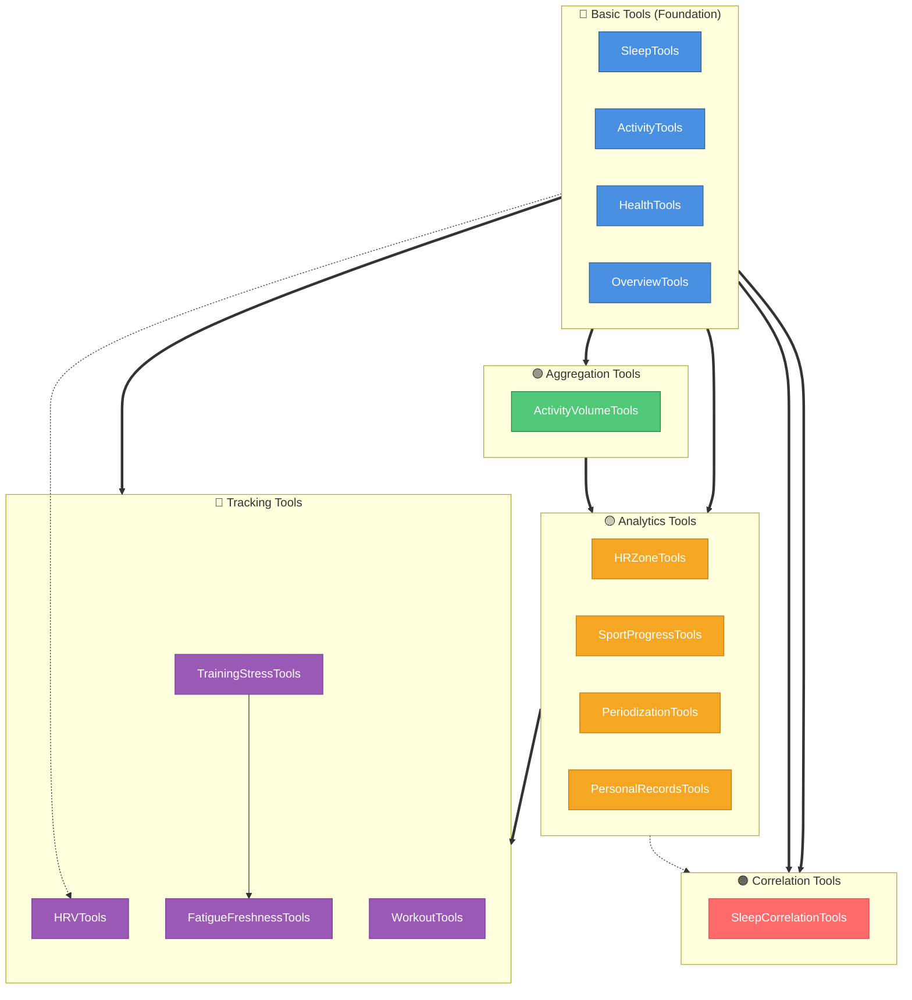
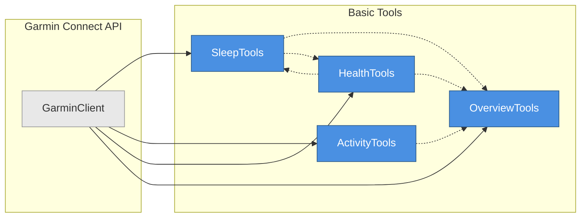
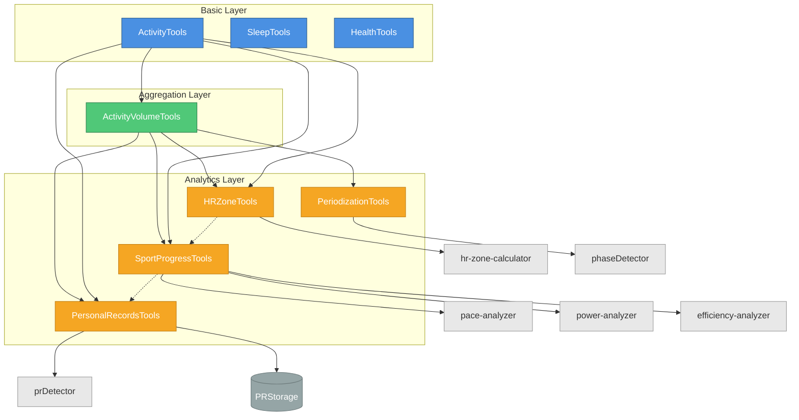
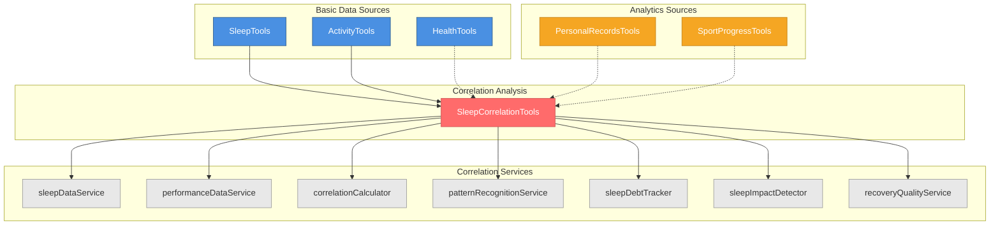
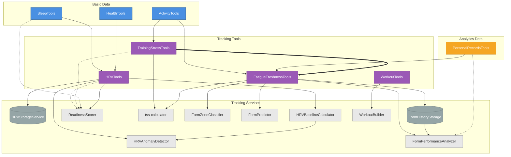
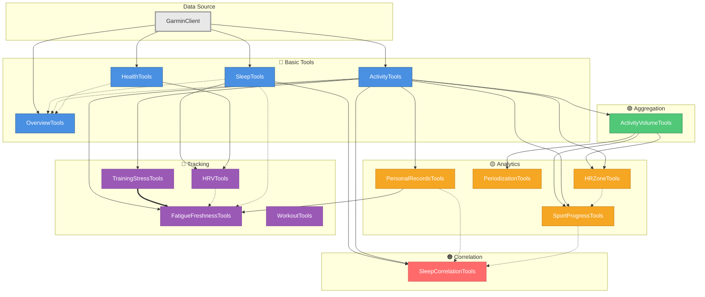

# Tool Dependency Diagrams

This document provides visual representations of dependencies between MCP tools in the Garmin Connect server. These diagrams help understand data flow, tool relationships, and the architectural hierarchy of the system.

## Legend

### Node Shapes
- **Rectangle with rounded corners**: Tool class (e.g., `SleepTools`)
- **Diamond**: Decision point or cross-category dependency
- **Cylinder**: Data storage or service layer

### Arrow Types
- **Solid arrow (→)**: Direct dependency (tool depends on another tool or service)
- **Dashed arrow (⇢)**: Optional or conditional dependency
- **Thick arrow (⇒)**: Data flow direction

### Categories & Colors
- **Basic**: Foundation tools providing raw data access
- **Aggregation**: Tools combining multiple data points
- **Analytics**: Tools performing analysis and calculations
- **Correlation**: Tools finding relationships between metrics
- **Tracking**: Tools monitoring trends over time

---

## 1. High-Level Category Architecture

This diagram shows the overall dependency flow between tool categories.



**Key Insights:**
- **Basic tools** are the foundation, providing raw data from Garmin Connect API
- **Aggregation tools** combine basic data across time periods
- **Analytics tools** depend on both basic and aggregation layers
- **Correlation tools** cross-reference multiple data sources
- **Tracking tools** have the most complex interdependencies

---

## 2. Basic Tools Dependencies

Basic tools primarily interact with Garmin Connect API and have minimal interdependencies.



**Key Insights:**
- All basic tools directly access `GarminClient`
- `OverviewTools` aggregates data from other basic tools
- Minimal interdependencies ensure independent operation
- Tools reference each other for related functionality

---

## 3. Aggregation & Analytics Dependencies

Shows how aggregation and analytics tools build upon basic tools and each other.



**Key Insights:**
- `ActivityVolumeTools` is the central aggregation layer
- Analytics tools depend on both raw activities and aggregated volume
- Each analytics tool has specialized service dependencies
- `PersonalRecordsTools` uses persistent storage
- Sport-specific analysis (pace/power) handled by dedicated services

---

## 4. Correlation Tools Dependencies

Shows how correlation tools cross-reference multiple data sources.



**Key Insights:**
- Correlation tools aggregate data from multiple tool categories
- Heavy reliance on specialized service layer
- Combines basic metrics (sleep) with performance outcomes (PRs, progress)
- Service layer handles complex statistical analysis
- Pattern recognition identifies optimal conditions for performance

---

## 5. Tracking Tools Dependencies

Shows complex interdependencies within tracking tools and their data sources.



**Key Insights:**
- **Critical dependency**: `FatigueFreshnessTools` depends on `TrainingStressTools` (TSS → Form)
- `ReadinessScorer` combines HRV, TSS, and sleep data
- Each tracking tool has dedicated storage and calculation services
- `FormPerformanceAnalyzer` correlates form state with PR achievements
- `WorkoutTools` is independent (workout creation, not analysis)
- HRV baseline calculation feeds anomaly detection

---

## 6. Complete System Dependency Graph (Detailed)

This diagram shows all major dependencies in a single view.



**Key Insights:**
- **Single entry point**: All tools ultimately depend on `GarminClient`
- **Layered architecture**: Clear progression from Basic → Aggregation → Analytics → Tracking
- **Critical path**: Activity → TSS → Form (training stress analysis chain)
- **Cross-category dependencies**: Correlation and Tracking tools bridge multiple layers
- **Independent tool**: `WorkoutTools` creates workouts but doesn't depend on other analysis tools

---

## How to Read These Diagrams

### Understanding Dependencies

1. **Solid arrows (→)**: Direct, required dependency
   - Example: `ActivityVolumeTools → ActivityTools` means volume tools require activity data

2. **Dashed arrows (⇢)**: Optional or reference relationship
   - Example: `SleepTools ⇢ HealthTools` means tools share related functionality

3. **Thick arrows (⇒)**: Critical data flow
   - Example: `TrainingStressTools ⇒ FatigueFreshnessTools` means TSS is essential for form calculation

### Tool Categories

- **Basic Tools**: Start here for raw data access (sleep, activities, health)
- **Aggregation Tools**: Use for combining data across time periods
- **Analytics Tools**: Use for performance analysis and trends
- **Correlation Tools**: Use for finding relationships between metrics
- **Tracking Tools**: Use for monitoring training load and readiness

### Common Patterns

1. **Data Collection**: Basic Tools → Aggregation Tools
2. **Performance Analysis**: Aggregation Tools → Analytics Tools
3. **Training Load**: Activity Tools → Training Stress Tools → Fatigue/Freshness Tools
4. **Recovery Analysis**: Sleep Tools + HRV Tools → Readiness Assessment
5. **Multi-source Analysis**: Multiple Basic/Analytics Tools → Correlation Tools

---

## Integration Examples

### Example 1: Training Load Monitoring

```
ActivityTools → TrainingStressTools → FatigueFreshnessTools
                                   → FormAnalysis
                                   → TaperPlan
```

### Example 2: Performance Optimization

```
ActivityTools → SportProgressTools → PaceTrends
                                  → EfficiencyMetrics
SleepTools → SleepCorrelationTools → OptimalSleepPattern
```

### Example 3: Readiness Assessment

```
SleepTools ┐
HRVTools   ├→ ReadinessScorer → ReadinessScore
TSSTools   ┘
```

---

## Maintenance Notes

These diagrams are generated from `@see` tags and import statements in the source code. When adding new tools or modifying dependencies:

1. Update the `@see` tags in tool file headers
2. Regenerate diagrams using this template
3. Validate Mermaid syntax in [Mermaid Live Editor](https://mermaid.live)
4. Ensure all dependencies are accurately represented
